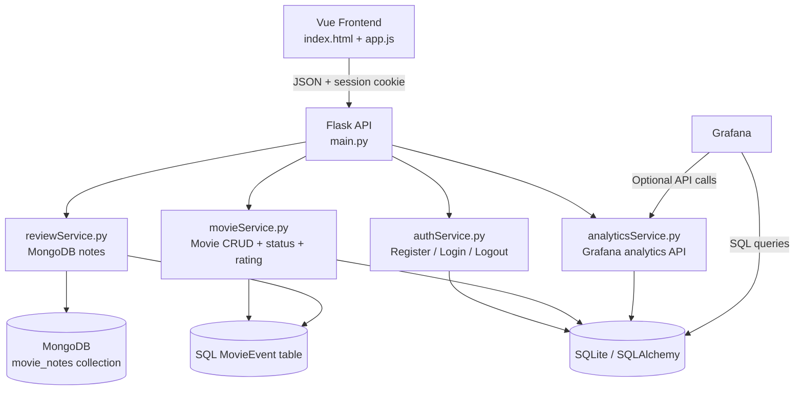

# Movie-kite


Movie-kite is a Flask + Vue movie tracker with session-based login, per-user SQL movie storage, MongoDB notes, event logging for analytics, and Grafana-ready query support.

## 1. Povzetek ideje

Movie-kite je spletna aplikacija za spremljanje filmov, kjer se uporabniki lahko registrirajo, prijavijo, dodajajo filme v `watchlist` ali `library`, shranjujejo zapiske o filmih in spremljajo lastno zgodovino aktivnosti.

Glavni cilj projekta je pokazati praktično uporabo:

- prijave in sej v Flasku,
- relacijske baze za strukturirane podatke,
- MongoDB za nestrukturirane zapiske,
- dogodkovnega logiranja za analitiko,
- Grafane za pregled uporabe in interakcij.

## 2. Arhitektura sistema



### Glavne plasti

- Frontend: `index.html` in `app.js` prikazujeta UI in pošiljata API klice.
- Avtentikacija: `authService.py` skrbi za registracijo, prijavo, odjavo in preverjanje seje.
- Film service: `movieService.py` upravlja filme, status, ocene in OMDb search proxy.
- Notes service: `reviewService.py` shranjuje zapiske v MongoDB.
- Analytics service: `analyticsService.py` vrača agregacije in zgodovino dogodkov.

## 3. Prijava in seje

Prijava je izvedena s Flask sejami.

### Potek prijave

1. Uporabnik odpre modal za login ali signup.
2. Flask preveri uporabniško geslo s hashom (`Werkzeug`).
3. Ob uspešni prijavi Flask v sejo shrani `user_id` in `username`.
4. Frontend pošilja requeste z `credentials: include`.
5. Zaščiteni endpointi vračajo samo podatke prijavljenega uporabnika.

### Pomembno

- Gesla se nikoli ne shranjujejo v navadni obliki.
- Seje so HTTP-only in same-site zaščitene.
- Movie in analytics endpointi delujejo na podatkih prijavljenega uporabnika, razen kadar gre za agregirane metrike.

## 4. Podatkovna arhitektura

### 4.1 SQL baza

SQL baza je glavni vir resnice za uporabnike, filme in analitiko.

#### Tabele

- `User`: `id`, `username`, `email`, `password_hash`
- `Movie`: `id`, `user_id`, `title`, `watch_list`, `library`, `mongo_pointer`, `year`, `poster_url`, `rating`
- `MovieEvent`: `id`, `user_id`, `movie_id`, `movie_title`, `event_type`, `details`, `created_at`

#### Namen posamezne tabele

- `User` hrani identiteto računa.
- `Movie` hrani trenutno stanje vsakega filma za posameznega uporabnika.
- `MovieEvent` hrani zgodovino aktivnosti za Grafano in analitiko.

### 4.2 MongoDB

MongoDB se uporablja za zapiske in review vsebino.

#### Kolekcija

- `movie_notes`

#### Dokument

- `movie_id`
- `user_id`
- `note`
- `last_updated`

#### Zakaj MongoDB

- zapiski so nestrukturirani,
- SQL tabela za filme ostane čista,
- kasneje je enostavno dodati bogatejšo review vsebino.

### 4.3 Zakaj dve bazi

- SQL je primeren za strogo strukturirane podatke, relacije in agregacije.
- MongoDB je primeren za fleksibilne zapiske in razširljive review podatke.
- Grafana uporablja SQL za števce, trende in časovne serije.

## 5. Event logging in analitika

Pomembne interakcije s filmi se zapisujejo v `MovieEvent`.

### Zajemani dogodki

- `movie_added`
- `movie_updated`
- `movie_status_changed`
- `movie_deleted`
- `movie_rated`
- `movie_note_saved`
- `movie_note_deleted`

### Kaj to omogoča

- zgodovino uporabniških dejanj,
- boljše Grafana dashboarde,
- prikaz najbolj aktivnih uporabnikov,
- prikaz najbolj gledanih/obravnavanih filmov,
- časovne serije aktivnosti po dnevih ali tednih.

### Analitični endpointi

- `GET /api/analytics/events`
- `GET /api/analytics/events/summary`
- `GET /api/analytics/movies/popularity`
- `GET /api/analytics/users/activity`

### Tipični primeri uporabe

- štetje dogodkov po dnevu,
- prikaz najbolj aktivnih uporabnikov,
- prikaz filmov z največ interakcijami,
- filtriranje po `username` ali `event_type`.

## 6. Grafana plan

Grafano lahko uporabiš na dva načina.

### 6.1 Neposredni SQL queryji

Najboljši za:

- števce,
- tabele,
- bar chart,
- pie chart,
- povzetke po uporabniku.

Query primeri so opisani v [Docs/grafanaQueriesDoc.md](Docs/grafanaQueriesDoc.md).

### 6.2 Analytics API

Najboljši za:

- custom dashboarde,
- vmesne integracijske storitve,
- JSON-based prikaz podatkov.

### Predlagani Grafana paneli

- Stat panel: total users, total events, total library rows, total watchlist rows
- Table panel: recent events, recent movies for a selected user
- Bar chart: events by type, top movies by interactions
- Time-series panel: daily event counts

## 7. API sloji

### Authentication

- `POST /api/auth/register`
- `POST /api/auth/login`
- `POST /api/auth/logout`
- `GET /api/auth/me`

### Movies

- `GET /movies/search?q=...`
- `POST /movies/add`
- `GET /movies/`
- `PUT /movies/{movie_id}/status`
- `PATCH /movies/{movie_id}/rating`
- `DELETE /movies/{movie_id}`

### Notes

- `GET /api/reviews/{movie_id}`
- `POST /api/reviews/{movie_id}`
- `DELETE /api/reviews/{movie_id}`

### Analytics

- `GET /api/analytics/events`
- `GET /api/analytics/events/summary`
- `GET /api/analytics/movies/popularity`
- `GET /api/analytics/users/activity`

## 8. Repo struktura

```text
Movie-kite/
├── README.md
├── main.py
├── app.js
├── index.html
├── models.py
├── extensions.py
├── movieService.py
├── reviewService.py
├── movieEvents.py
├── authService.py
├── analyticsService.py
├── test_auth_smoke.py
├── requirements.txt
├── Docs/
│   ├── rootDoc.md
│   ├── movieServiceDoc.md
│   ├── reviewServiceDoc.md
│   ├── missingServicesDoc.md
│   └── grafanaQueriesDoc.md
└── instance/
```

## 9. Environment variables

The app currently reads:

- `SECRET_KEY` — Flask session key
- `DATABASE_URL` — SQL database URL, defaults to SQLite `movies.db`
- `MONGO_URI` — MongoDB connection string
- `API_KEY` — OMDb API key for search proxying

## 10. Run

```bash
source .venv/bin/activate
./.venv/bin/python main.py
```

Open the app at `http://127.0.0.1:5000/` so authentication cookies and session state work correctly.

## Production deployment with Nginx

Use Gunicorn to run the Flask app on loopback, then let Nginx expose the public site on `movie-kite.top`.

1. Install the production dependency:

```bash
source .venv/bin/activate
pip install gunicorn
```

2. Set production environment variables in `.env`:

```dotenv
SECRET_KEY=change-me
SESSION_COOKIE_SECURE=true
MONGO_URI=mongodb://localhost:27017/movieDB
DATABASE_URL=sqlite:///movies.db
```

3. Create the systemd unit from `deploy/systemd/movie-kite.service`, then enable it:

```bash
sudo cp deploy/systemd/movie-kite.service /etc/systemd/system/movie-kite.service
sudo systemctl daemon-reload
sudo systemctl enable --now movie-kite.service
sudo systemctl status movie-kite.service
```

4. Create the Nginx site from `deploy/nginx/movie-kite.conf` and reload Nginx:

```bash
sudo cp deploy/nginx/movie-kite.conf /etc/nginx/sites-available/movie-kite.conf
sudo ln -s /etc/nginx/sites-available/movie-kite.conf /etc/nginx/sites-enabled/movie-kite.conf
sudo nginx -t
sudo systemctl reload nginx
```

5. If you are using HTTPS, add a certificate with Certbot after the site is reachable on port 80.

The Gunicorn service binds to `127.0.0.1:5000`, so Nginx is the only public-facing process.

## Data model

This repository now includes production deployment files:

- `Dockerfile` (Flask app with Gunicorn)
- `nginx.conf` (reverse proxy)
- `docker-compose.yml` (Nginx + Flask app + MongoDB)

### Start deployment

```bash
docker compose up --build -d
```

Open:

- `http://localhost:8080/` (served through Nginx)

### Stop deployment

```bash
docker compose down
```

### Configure secrets/environment

Set strong values for:

- `SECRET_KEY`
- `API_KEY` (OMDb)

You can export them before starting Compose:

```bash
export SECRET_KEY='replace-with-a-strong-secret'
export API_KEY='your-omdb-key'
docker compose up --build -d
```

## 12. Validation

### Auth smoke test

```bash
./.venv/bin/python -m unittest test_auth_smoke.py
```

### Python syntax check

```bash
./.venv/bin/python -m py_compile main.py movieService.py reviewService.py models.py movieEvents.py authService.py analyticsService.py
```

## 13. Requirements

The current Python dependencies already cover the app, including `gunicorn` for production serving.

No `requirements.txt` update is needed unless you add a new package.

## 14. Notes

- Passwords are stored as hashes, never plain text.
- Movie rows are scoped to the signed-in user.
- MongoDB stores notes/reviews for the user’s own movies.
- Grafana dashboards should use SQL for counts and trends, not table scraping.
- If you later want full time-series dashboarding, `MovieEvent` is the right source of truth.
