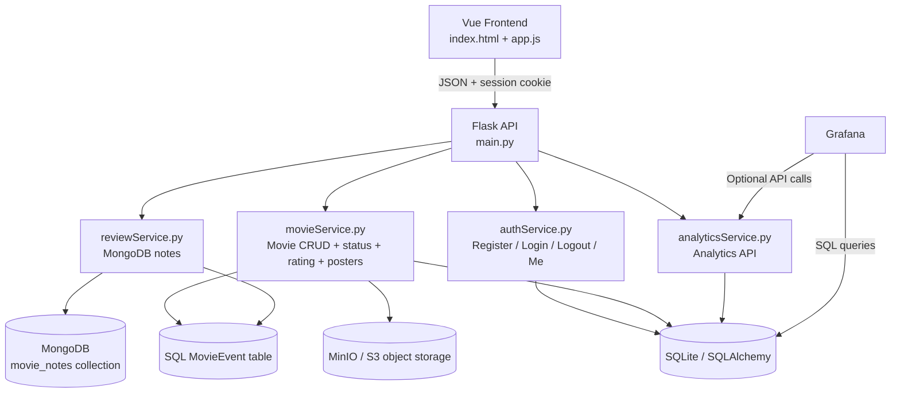

# Movie-kite


Movie-kite is a Flask + Vue movie tracker with session-based login, per-user movie storage, MongoDB notes, event logging for analytics, poster proxying/object storage, and Grafana-ready query support.

## 1. Project overview

Movie-kite lets users register, sign in, search movies, save them to a personal `watchlist` or `library`, attach notes, rate entries, and review their own activity over time.

The project demonstrates practical usage of:

- Flask sessions for authentication,
- SQLAlchemy for structured relational data,
- MongoDB for flexible per-movie notes,
- event logging for analytics,
- object storage for poster images,
- Grafana-friendly SQL queries for dashboards.

## 2. System architecture



### Main layers

- Frontend: `index.html` and `app.js` render the UI and call the API.
- Auth: `authService.py` manages registration, login, logout, and session checks.
- Movies: `movieService.py` handles search, CRUD, rating, status changes, and poster storage/proxying.
- Reviews: `reviewService.py` stores per-user notes in MongoDB.
- Analytics: `analyticsService.py` exposes event summaries and usage metrics.

## 3. Feature set

### User accounts

- register a new account,
- log in and log out using Flask sessions,
- keep cookies HTTP-only and same-site protected,
- restrict movie data to the signed-in user.

### Movie management

- search OMDb from the backend,
- save movies to watchlist or library,
- move movies between statuses,
- update ratings,
- delete movies,
- preserve per-user ownership.

### Poster handling

- store poster images in object storage,
- fetch poster bytes through a backend proxy,
- fall back to the original poster URL if upload fails,
- serve posters back to the frontend without exposing direct storage details.

### Notes and analytics

- store free-form notes in MongoDB,
- log actions in `MovieEvent`,
- expose analytics endpoints for dashboards,
- support future Grafana panels and reports.

## 4. Authentication and sessions

Login is session-based.

### Flow

1. The user registers or logs in through the frontend.
2. The backend hashes passwords with Werkzeug.
3. Flask stores `user_id` and `username` in the session.
4. The frontend sends requests with `credentials: 'include'`.
5. Protected routes only return the current user’s data.

### Security notes

- Passwords are never stored in plain text.
- Session cookies are `HTTPOnly` and `SameSite=Lax`.
- `SESSION_COOKIE_SECURE` can be enabled for HTTPS deployments.

## 5. Data architecture

### SQL database

SQLite stores the structured parts of the app.

#### Tables

- `User`: `id`, `username`, `email`, `password_hash`
- `Movie`: `id`, `user_id`, `title`, `watch_list`, `library`, `mongo_pointer`, `year`, `poster_url`, `rating`
- `MovieEvent`: `id`, `user_id`, `movie_id`, `movie_title`, `event_type`, `details`, `created_at`

#### Why SQL

- fixed schema for users and movies,
- reliable joins and filtering,
- good fit for analytics queries,
- easy per-user ownership checks.

### MongoDB

MongoDB stores flexible notes.

#### Collection

- `movie_notes`

#### Fields

- `movie_id`
- `user_id`
- `note`
- `last_updated`

#### Why MongoDB

- notes can stay unstructured,
- the SQL movie model stays clean,
- note content can evolve later without migrations.

### Object storage

Poster images are handled by `posterStorageService.py`.

#### Behaviour

- downloads poster images from an external URL,
- uploads them to MinIO/S3,
- returns a saved poster URL,
- can fetch or delete stored posters later,
- proxies posters through `/movies/poster` for frontend rendering.

## 6. Event logging and analytics

Important movie interactions are recorded in `MovieEvent`.

### Logged events

- `movie_added`
- `movie_updated`
- `movie_status_changed`
- `movie_deleted`
- `movie_rated`
- `movie_note_saved`
- `movie_note_deleted`

### Analytics endpoints

- `GET /api/analytics/events`
- `GET /api/analytics/events/summary`
- `GET /api/analytics/movies/popularity`
- `GET /api/analytics/users/activity`

### What this enables

- recent activity feeds,
- top-movie charts,
- active-user rankings,
- time-based trend panels,
- Grafana dashboards backed by SQL.

## 7. API surface

### Authentication

- `POST /api/auth/register`
- `POST /api/auth/login`
- `POST /api/auth/logout`
- `GET /api/auth/me`

### Movies

- `GET /movies/search?q=...`
- `POST /movies/add`
- `GET /movies/`
- `GET /movies/poster?url=...`
- `PUT /movies/{movie_id}/status`
- `PATCH /movies/{movie_id}/rating`
- `DELETE /movies/{movie_id}`

### Notes

- `GET /api/reviews/{movie_id}`
- `POST /api/reviews/{movie_id}`
- `DELETE /api/reviews/{movie_id}`

### Analytics

- `GET /api/analytics/events`
- `GET /api/analytics/events/summary`
- `GET /api/analytics/movies/popularity`
- `GET /api/analytics/users/activity`

## 8. Environment variables

The app reads:

- `SECRET_KEY` — Flask session secret
- `SESSION_COOKIE_SECURE` — set to `true` behind HTTPS
- `DATABASE_URL` — SQLAlchemy connection string, defaults to SQLite `movies.db`
- `MONGO_URI` — MongoDB connection string
- `API_KEY` — OMDb API key for search requests
- `minio_endpoint` — MinIO/S3 endpoint used by poster storage
- `minio_access_key` — storage access key
- `minio_secret_key` — storage secret key

### Poster storage note

The current poster storage service uses a fixed bucket name (`user-05`) in code.
If you change that, update `posterStorageService.py` consistently.

## 9. Local development

```bash
source .venv/bin/activate
./.venv/bin/python main.py
```

Open the app at `http://127.0.0.1:5000/` so session cookies work correctly.

### Useful checks

```bash
./.venv/bin/python -m unittest test_auth_smoke.py
./.venv/bin/python -m py_compile main.py movieService.py reviewService.py models.py movieEvents.py authService.py analyticsService.py posterStorageService.py
```

## 10. Production deployment with Nginx

Run the Flask app with Gunicorn on loopback, then expose it through Nginx.

### 1. Install Gunicorn

```bash
source .venv/bin/activate
pip install gunicorn
```

### 2. Set production environment variables in `.env`

```dotenv
SECRET_KEY=change-me
SESSION_COOKIE_SECURE=true
DATABASE_URL=sqlite:///movies.db
MONGO_URI=mongodb://localhost:27017/movieDB
API_KEY=your-omdb-key
minio_endpoint=http://127.0.0.1:9000
minio_access_key=your-access-key
minio_secret_key=your-secret-key
```

### 3. Enable the systemd service

```bash
sudo cp deploy/systemd/movie-kite.service /etc/systemd/system/movie-kite.service
sudo systemctl daemon-reload
sudo systemctl enable --now movie-kite.service
sudo systemctl status movie-kite.service
```

### 4. Enable the Nginx site

```bash
sudo cp deploy/nginx/movie-kite.conf /etc/nginx/sites-available/movie-kite.conf
sudo ln -s /etc/nginx/sites-available/movie-kite.conf /etc/nginx/sites-enabled/movie-kite.conf
sudo nginx -t
sudo systemctl reload nginx
```

### 5. Add HTTPS if needed

After the site is reachable on port 80, add a certificate with Certbot.

The Gunicorn service binds to `127.0.0.1:5000`, so Nginx remains the only public-facing process.

## 11. Repository structure

```text
Movie-kite/
├── README.md
├── main.py
├── app.js
├── index.html
├── models.py
├── extensions.py
├── movieService.py
├── reviewService.py
├── authService.py
├── analyticsService.py
├── movieEvents.py
├── posterStorageService.py
├── test_auth_smoke.py
├── requirements.txt
├── Docs/
│   ├── rootDoc.md
│   ├── movieServiceDoc.md
│   ├── reviewServiceDoc.md
│   ├── missingServicesDoc.md
│   └── grafanaQueriesDoc.md
├── assets/
├── deploy/
│   ├── nginx/
│   └── systemd/
└── instance/
```

## 12. Validation

### Smoke test

```bash
./.venv/bin/python -m unittest test_auth_smoke.py
```

### Syntax check

```bash
./.venv/bin/python -m py_compile main.py movieService.py reviewService.py models.py movieEvents.py authService.py analyticsService.py posterStorageService.py
```

## 13. Design notes

- Movie data is scoped to the signed-in user.
- MongoDB stores notes for the user’s own movies.
- Event logs are the source of truth for analytics.
- Poster URLs are normalized through a backend proxy so the frontend does not depend on direct storage access.
- The app is intentionally split into small service modules to keep each responsibility focused.

## 14. Roadmap ideas

- add unit tests for poster upload and proxy handling,
- harden poster URL fetching against SSRF,
- add CSRF protection for state-changing requests,
- externalize the MinIO bucket name to configuration,
- add dashboard examples for Grafana panels.

## 15. Documentation

The `Docs/` directory contains deeper, module-specific notes:

- [Docs/rootDoc.md](Docs/rootDoc.md) — high-level backend overview and data split.
- [Docs/movieServiceDoc.md](Docs/movieServiceDoc.md) — movie routes, poster proxying, and storage flow.
- [Docs/reviewServiceDoc.md](Docs/reviewServiceDoc.md) — MongoDB review/note behavior.
- [Docs/missingServicesDoc.md](Docs/missingServicesDoc.md) — status of implemented services.
- [Docs/grafanaQueriesDoc.md](Docs/grafanaQueriesDoc.md) — SQL query examples for Grafana.

If you are extending the app, start with the matching file in `Docs/` before changing code.

## 16. Module-by-module guide

This section maps the main files to their responsibilities so the codebase is easier to navigate.

### `main.py`

- creates the Flask app,
- loads environment variables,
- configures SQLAlchemy, MongoDB, sessions, and CORS,
- registers all blueprints,
- serves the frontend entry page.

### `authService.py`

- handles registration,
- handles login and logout,
- exposes the current signed-in user,
- stores session data used by the rest of the app.

### `movieService.py`

- proxies OMDb search requests,
- stores movie rows in SQLite,
- updates status and rating,
- deletes movies,
- uploads poster images to object storage,
- proxies stored posters back to the browser.

### `reviewService.py`

- saves free-form movie notes,
- reads notes back for display,
- deletes notes without removing the movie,
- keeps note data in MongoDB.

### `analyticsService.py`

- exposes event feeds,
- summarizes event counts,
- ranks movies by interaction volume,
- aggregates user activity for reporting.

### `movieEvents.py`

- centralizes event creation,
- records activity when movies or notes change,
- keeps analytics data consistent across services.

### `posterStorageService.py`

- downloads poster images from external URLs,
- uploads them to the MinIO/S3 bucket,
- fetches stored images when the frontend needs them,
- deletes stored posters when a movie is removed.

### `models.py`

- defines the SQLAlchemy models,
- keeps the `User`, `Movie`, and `MovieEvent` schemas in one place,
- provides `to_dict()` helpers used by the API.

### `extensions.py`

- initializes shared extensions,
- exports the SQLAlchemy and MongoDB objects used across the app.

### `app.js`

- drives the Vue frontend,
- performs login and movie actions through the API,
- normalizes poster URLs for rendering,
- loads user notes and movie lists,
- handles the client-side navigation state.

### `index.html`

- contains the frontend templates,
- mounts the Vue app,
- defines the page structure and reusable UI fragments.

### `wsgi.py`

- exposes the app for Gunicorn or WSGI servers,
- is the entry point used in production deployments.

### `test_auth_smoke.py`

- checks that authentication behavior still works,
- provides a quick regression test for session/login logic.

### `deploy/`

- `deploy/nginx/movie-kite.conf` configures the reverse proxy,
- `deploy/systemd/movie-kite.service` runs the app as a service.

## 17. Related documentation files

Use these when you need deeper context than the README gives:

- [Docs/rootDoc.md](Docs/rootDoc.md) — architecture and storage split.
- [Docs/movieServiceDoc.md](Docs/movieServiceDoc.md) — movie service routes and poster flow.
- [Docs/reviewServiceDoc.md](Docs/reviewServiceDoc.md) — MongoDB notes and review behavior.
- [Docs/missingServicesDoc.md](Docs/missingServicesDoc.md) — implemented-service status.
- [Docs/grafanaQueriesDoc.md](Docs/grafanaQueriesDoc.md) — SQL examples for Grafana.
